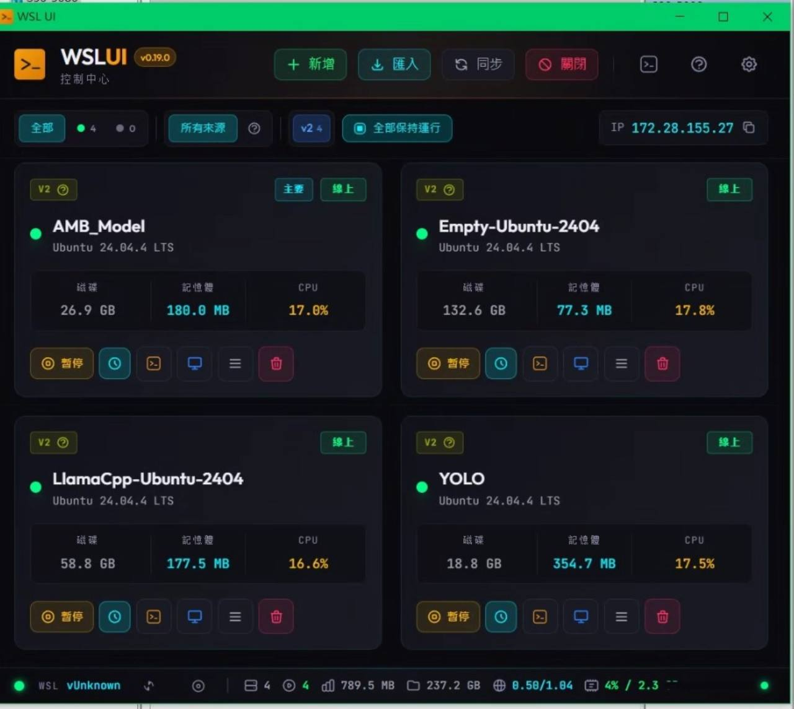

# WSL UI

A lightweight desktop application to manage Windows Subsystem for Linux (WSL)
distributions.

Built with [Tauri](https://tauri.app/) (Rust) and [React](https://react.dev/)
(TypeScript).

## WSL UI Keepalive 版本

這個 fork 以原版 WSL UI 為基礎，加入適合長時間運行多個 WSL
發行版的管理功能。



主要調整：

- **保持運行**：可針對單一 WSL 勾選保持運行，也可用上方「全部保持運行」一次選取目前列表中的 WSL。
- **不自動套用新 WSL**：新安裝或新匯入的 WSL 不會自動被加入保持運行清單，避免誤啟動不需要常駐的環境。
- **卡片資源監控**：每張 WSL 卡片保留磁碟、記憶體、CPU，避免把共用的 WSL VM 網路/GPU 誤認為單一發行版數據。
- **底部全域狀態列**：集中顯示 WSL IP、執行個體數、總記憶體、總磁碟、全域網路流量與 GPU 使用狀態。
- **網路與 GPU 判讀**：WSL2 多個發行版共用同一個 VM 網路與 GPU 指標，因此以全域狀態呈現，避免在每張卡片上重複顯示造成誤解。

**Maintained by [尤濬哲 / youjunjer](https://github.com/youjunjer)** | **[GitHub](https://github.com/youjunjer/wsl-ui-keepalive)**

[](https://youtu.be/q59ZtKr7aqw)

## Features

- **Dashboard** - View all distributions with real-time status, CPU, memory, and disk usage
- **Quick Actions** - Terminal, file explorer, IDE, restart, export, clone
- **Install from Anywhere** - Microsoft Store, Docker/Podman images, LXC catalog, custom URLs
- **Backup & Restore** - Export, import, and clone distributions
- **Custom Actions** - Define reusable commands with variable substitution
- **WSL Settings** - Edit `.wslconfig` and `wsl.conf` from a visual interface
- **17 Themes** - Dark, light, and custom themes with live preview
- **System Tray** - Minimize to tray for quick access
- **Disk Mounting** - Mount VHD files and physical disks into WSL

See the [User Guide](docs/USER-GUIDE.md) for detailed features and screenshots.

## Language Support

WSL UI is available in multiple languages. The app automatically detects your
system language, or you can switch manually from the settings.

| Language | Native Name |
|----------|-------------|
| English | English |
| Arabic | العربية |
| Chinese (Simplified) | 简体中文 |
| Chinese (Traditional) | 繁體中文 |
| French | Français |
| German | Deutsch |
| Hindi | हिन्दी |
| Japanese | 日本語 |
| Korean | 한국어 |
| Polish | Polski |
| Portuguese (Brazil) | Português (Brasil) |
| Russian | Русский |
| Spanish | Español |
| Turkish | Türkçe |

Don't see your language?
[Open an issue](https://github.com/youjunjer/wsl-ui-keepalive/issues) to request it.

## Installation

### From Microsoft Store

[](https://apps.microsoft.com/detail/9p8548knj2m9)

### From Releases

Download the latest installer from the
[Releases](https://github.com/youjunjer/wsl-ui-keepalive/releases) page.

### From Source

**Prerequisites:** [Node.js](https://nodejs.org/) v18+,
[Rust](https://rustup.rs/), Windows (not WSL)

```bash
git clone https://github.com/youjunjer/wsl-ui-keepalive.git
cd wsl-ui-keepalive
npm install
npm run tauri dev
```

## Documentation

- [User Guide](docs/USER-GUIDE.md) - Features, screenshots, and how-to guides
- [Troubleshooting](docs/TROUBLESHOOTING.md) - Solutions to common issues
- [Privacy Policy](docs/PRIVACY.md) - How we handle your data (we don't collect any)
- [Contributing](CONTRIBUTING.md) - How to contribute to the project

## Development

### Project Structure

```
wsl-ui/
├── src/                    # React frontend
│   ├── components/         # UI components
│   ├── services/           # Tauri API wrappers
│   ├── store/              # Zustand state management
│   └── test/e2e/           # WebDriverIO E2E tests
├── src-tauri/              # Rust backend
│   └── src/                # Tauri commands and WSL logic
└── crates/wsl-core/        # Shared WSL parsing library
```

### Tech Stack

| Layer    | Technology        | Purpose                      |
|----------|-------------------|------------------------------|
| Desktop  | Tauri 2.x         | Native window, system access |
| Frontend | React 19 + Vite   | UI components                |
| Styling  | Tailwind CSS      | Utility-first CSS            |
| Backend  | Rust              | WSL command execution        |
| State    | Zustand           | State management             |

### Scripts

```bash
npm run tauri dev       # Development mode
npm run tauri build     # Production build
npm run test:run        # Unit tests
npm run test:e2e:dev    # E2E tests (mock mode)
```

## License

This project is licensed under the GNU General Public License v3.0 (GPL-3.0) -
see the [LICENSE](LICENSE) file for details.

- **Free and open source** software
- **Copyleft** — derivative works must also be open source under GPL-3.0
- **Source code** must be provided with any distribution

## Links

- [Maintainer](https://github.com/youjunjer)
- [Repository](https://github.com/youjunjer/wsl-ui-keepalive)
- [Report Issues](https://github.com/youjunjer/wsl-ui-keepalive/issues)
- [Security Policy](SECURITY.md)
- [Changelog](CHANGELOG.md)
- [Credits](CREDITS.md)
