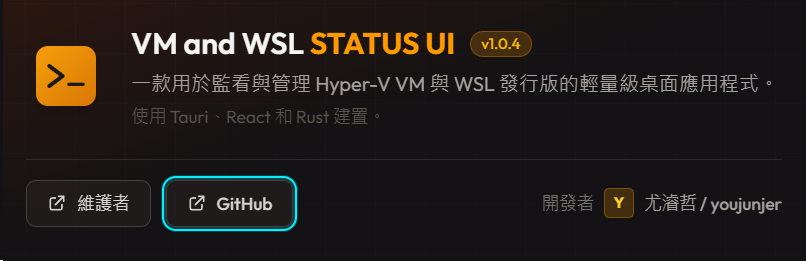
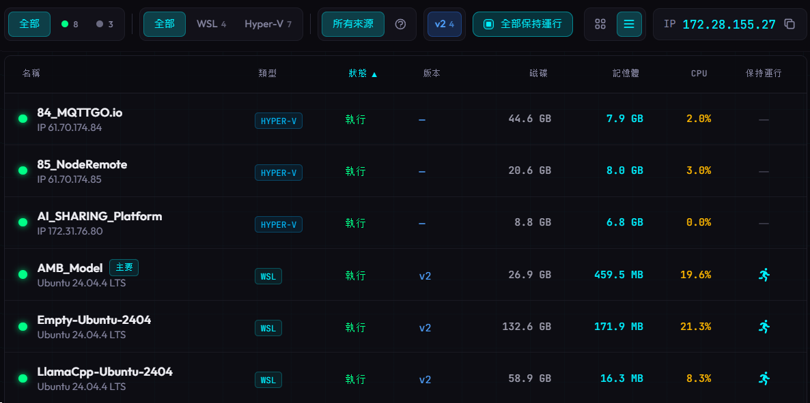
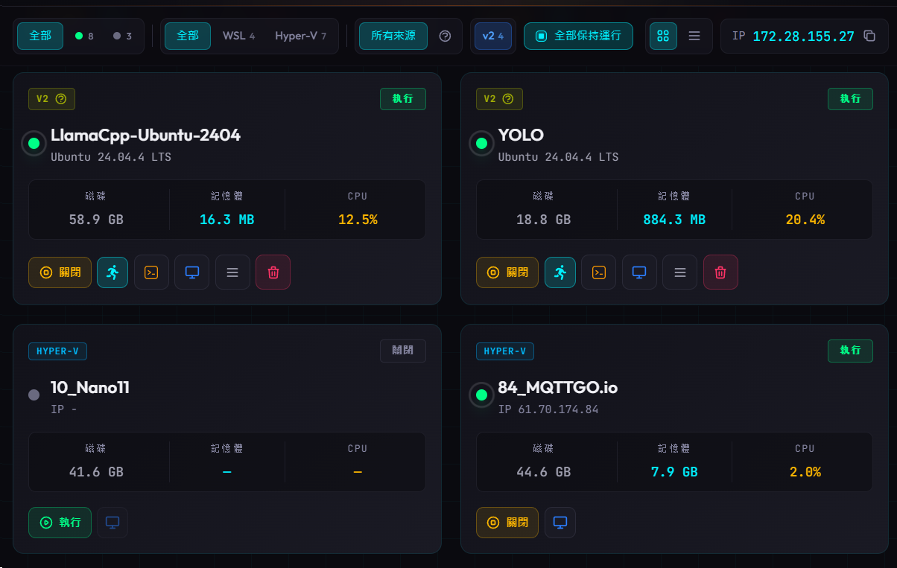

# VM and WSL STATUS UI

一款用於監看與管理 Hyper-V VM 與 Windows Subsystem for Linux (WSL)
發行版的輕量級 Windows 桌面應用程式。

A lightweight Windows desktop application for monitoring and managing Hyper-V
VMs and Windows Subsystem for Linux (WSL) distributions.

Built with [Tauri](https://tauri.app/) (Rust) and [React](https://react.dev/)
(TypeScript).



**Maintained by [尤濬哲 / youjunjer](https://github.com/youjunjer)** |
**[GitHub](https://github.com/youjunjer/wsl-ui-keepalive)**

## 原始專案與授權

本專案 fork 自 Octasoft Ltd 的 WSL UI：
[octasoft-ltd/wsl-ui](https://github.com/octasoft-ltd/wsl-ui)。

此分支保留原專案的 GPL-3.0 授權，並在原始 WSL UI 的基礎上加入
WSL keepalive、Hyper-V VM 監看與雙平台狀態管理。原作者的完整開發脈絡
與 commit history 請參考上游原始專案。

## Original Project and License

This project is a fork of Octasoft Ltd's WSL UI:
[octasoft-ltd/wsl-ui](https://github.com/octasoft-ltd/wsl-ui).

This branch keeps the original GPL-3.0 license and adds WSL keepalive, Hyper-V
VM monitoring, and dual-platform status management on top of the original WSL
UI. For the original development context and commit history, please refer to
the upstream project.

## 中文說明

這個 fork 以原版 WSL UI 為基礎，擴充為可同時監看 Hyper-V VM 與 WSL
發行版的狀態中心，並加入 WSL 保持運行、列表/卡片切換、排序與 Hyper-V
主控台連線等功能。

### 主要功能

- **Hyper-V + WSL 整合監看**：在同一個畫面查看 Hyper-V VM 與 WSL 發行版。
- **列表與卡片模式**：可依名稱、類型、狀態、磁碟、記憶體、CPU 排序。
- **WSL 保持運行**：可針對單一 WSL 啟用保持運行，也可用「全部保持運行」一次選取目前列表中的 WSL。
- **不自動套用新 WSL**：新安裝或新匯入的 WSL 不會自動加入保持運行清單，避免誤啟動不需要常駐的環境。
- **Hyper-V 控制**：支援 Hyper-V VM 執行/關閉與 Hyper-V 主控台連線。
- **全域狀態列**：集中顯示 WSL IP、執行個體數、總記憶體、總磁碟、全域網路流量與 GPU 使用狀態。
- **資料判讀更清楚**：WSL2 多個發行版共用同一個 VM 網路與 GPU 指標，因此以全域狀態呈現，避免在每張卡片上重複顯示造成誤解。

### 畫面預覽





## English

This fork extends the original WSL UI into a status center for both Hyper-V VMs
and WSL distributions. It adds WSL keep-alive controls, list/card views,
sortable columns, and Hyper-V console access.

### Features

- **Hyper-V + WSL monitoring** - View Hyper-V VMs and WSL distributions in one dashboard.
- **List and card views** - Sort by name, type, status, disk, memory, and CPU.
- **WSL keep alive** - Keep selected WSL distributions running, or select all currently listed WSL distributions at once.
- **No automatic keep-alive for new WSL instances** - Newly installed or imported WSL distributions are not enabled automatically.
- **Hyper-V controls** - Start, stop, and open the Hyper-V console for VMs.
- **Global status bar** - Shows WSL IP, running instance count, total memory, total disk usage, global network throughput, and GPU usage.
- **Clearer metric semantics** - WSL2 distributions share VM-level network and GPU metrics, so these values are shown globally instead of repeated on every card.

### Screenshots


See the [User Guide](docs/USER-GUIDE.md) for detailed features and screenshots.

## Language Support

WSL UI is available in multiple languages. The app automatically detects your
system language, or you can switch manually from the settings.

| Language | Native Name |
|----------|-------------|
| English | English |
| Arabic | العربية |
| Chinese (Simplified) | 简体中文 |
| Chinese (Traditional) | 繁體中文 |
| French | Français |
| German | Deutsch |
| Hindi | हिन्दी |
| Japanese | 日本語 |
| Korean | 한국어 |
| Polish | Polski |
| Portuguese (Brazil) | Português (Brasil) |
| Russian | Русский |
| Spanish | Español |
| Turkish | Türkçe |

Don't see your language?
[Open an issue](https://github.com/youjunjer/wsl-ui-keepalive/issues) to request it.

## Installation

### From Microsoft Store

[](https://apps.microsoft.com/detail/9p8548knj2m9)

### From Releases

Download the latest installer from the
[Releases](https://github.com/youjunjer/wsl-ui-keepalive/releases) page.

### From Source

**Prerequisites:** [Node.js](https://nodejs.org/) v18+,
[Rust](https://rustup.rs/), Windows (not WSL)

```bash
git clone https://github.com/youjunjer/wsl-ui-keepalive.git
cd wsl-ui-keepalive
npm install
npm run tauri dev
```

## Documentation

- [User Guide](docs/USER-GUIDE.md) - Features, screenshots, and how-to guides
- [Troubleshooting](docs/TROUBLESHOOTING.md) - Solutions to common issues
- [Privacy Policy](docs/PRIVACY.md) - How we handle your data (we don't collect any)
- [Contributing](CONTRIBUTING.md) - How to contribute to the project

## Development

### Project Structure

```
wsl-ui/
├── src/                    # React frontend
│   ├── components/         # UI components
│   ├── services/           # Tauri API wrappers
│   ├── store/              # Zustand state management
│   └── test/e2e/           # WebDriverIO E2E tests
├── src-tauri/              # Rust backend
│   └── src/                # Tauri commands and WSL logic
└── crates/wsl-core/        # Shared WSL parsing library
```

### Tech Stack

| Layer    | Technology        | Purpose                      |
|----------|-------------------|------------------------------|
| Desktop  | Tauri 2.x         | Native window, system access |
| Frontend | React 19 + Vite   | UI components                |
| Styling  | Tailwind CSS      | Utility-first CSS            |
| Backend  | Rust              | WSL command execution        |
| State    | Zustand           | State management             |

### Scripts

```bash
npm run tauri dev       # Development mode
npm run tauri build     # Production build
npm run test:run        # Unit tests
npm run test:e2e:dev    # E2E tests (mock mode)
```

## License

This project is licensed under the GNU General Public License v3.0 (GPL-3.0) -
see the [LICENSE](LICENSE) file for details.

- **Free and open source** software
- **Copyleft** — derivative works must also be open source under GPL-3.0
- **Source code** must be provided with any distribution

## Links

- [Maintainer](https://github.com/youjunjer)
- [Repository](https://github.com/youjunjer/wsl-ui-keepalive)
- [Report Issues](https://github.com/youjunjer/wsl-ui-keepalive/issues)
- [Security Policy](SECURITY.md)
- [Changelog](CHANGELOG.md)
- [Credits](CREDITS.md)
