# WSL UI User Guide

A complete guide to managing your WSL distributions with WSL UI.

## Table of Contents

- [Dashboard Overview](#dashboard-overview)
- [Toolbar](#toolbar)
- [Managing Distributions](#managing-distributions)
- [Quick Actions](#quick-actions)
- [Remote Desktop (xrdp)](#remote-desktop-xrdp)
- [GPU Status & NVIDIA Containers](#gpu-status--nvidia-containers)
- [Installing New Distributions](#installing-new-distributions)
- [Linux Desktop Setup Scripts](#linux-desktop-setup-scripts)
- [Backup and Restore](#backup-and-restore)
- [Custom Actions](#custom-actions)
- [Language](#language)
- [Settings](#settings)
- [Pending Configuration Changes](#pending-configuration-changes)
- [Themes](#themes)
- [Keyboard Shortcuts & Accessibility](#keyboard-shortcuts--accessibility)

---

## Dashboard Overview

The main dashboard shows all your WSL distributions at a glance.


Each distribution card displays:
- **Name** and Linux distribution info
- **Status badge** - Running (green) or Stopped (gray)
- **WSL version** - WSL 1 or WSL 2
- **Resource usage** - CPU, memory, and disk when running
- **Source badge** - How the distribution was installed (Store, Container, Import, etc.)

### Filtering Distributions

Use the filter bar to find specific distributions:

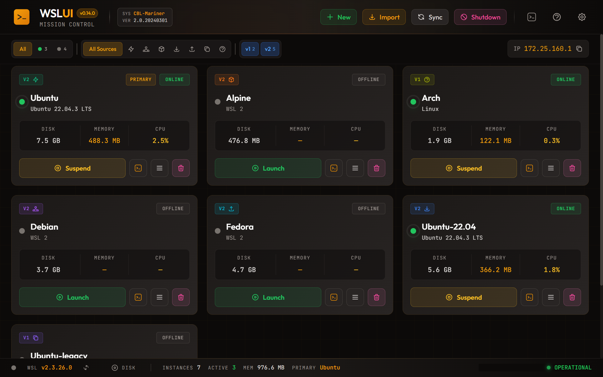

- **Status** - Show only running or stopped distributions
- **Source** - Filter by installation method
- **WSL Version** - Show only WSL 1 or WSL 2

### Status Bar

The status bar at the bottom of the dashboard shows:
- Health status indicator
- WSL version with update button
- Mounted disks count
- Distribution count (instances/active)
- Total memory usage
- Default distribution name

---

## Toolbar

The header toolbar at the top of the window provides the primary actions:

- **New** - Open the dialog to install a new distribution (Microsoft Store, container image, LXC catalog, or custom source).
- **Import** - Restore a distribution from a `.tar` backup file.
- **Sync** - Manually refresh the dashboard from WSL. This re-reads the list of installed distributions and updates their state, disk size, OS info, and metadata. The app already polls in the background on a configurable interval (see [Settings](#settings)), but **Sync** triggers an immediate, visible refresh. It is useful after you make changes outside the app — for example, running `wsl --import`, `wsl --unregister`, or `wsl --set-default` from a terminal — when you want the dashboard to reflect those changes right away rather than waiting for the next poll.
- **Shutdown** - Shut down all running WSL distributions (asks for confirmation). Equivalent to `wsl --shutdown`.
- **Open WSL System Shell** - Launch a terminal in the WSL system (admin) context.
- **Help** - Open the in-app help.
- **Settings** - Open the [Settings](#settings) page.

---

## Managing Distributions

### Quick Actions Menu

Right-click any distribution or use the menu button to access quick actions:

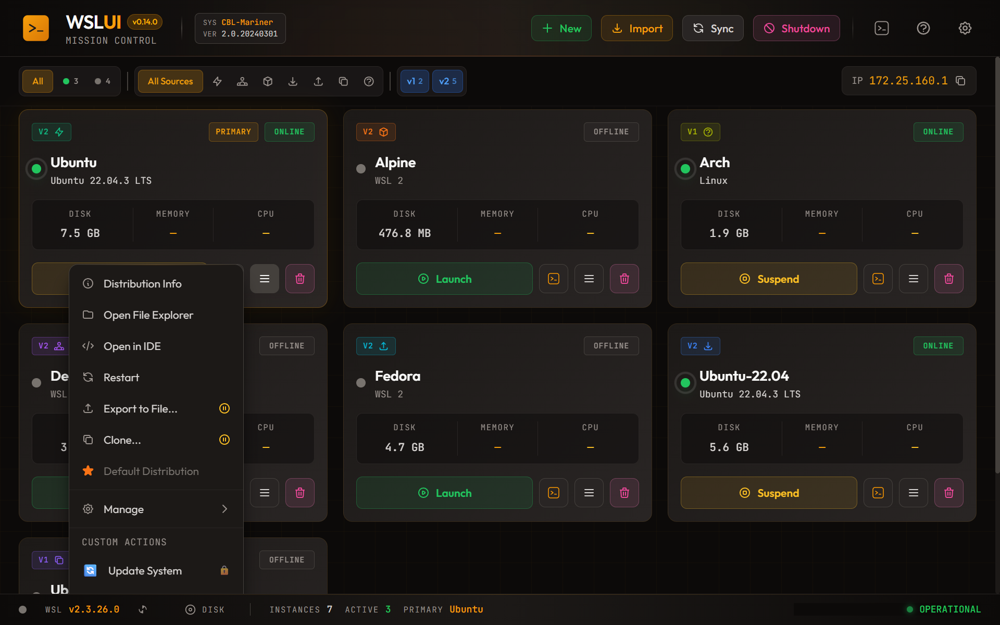

- **Open Terminal** - Launch a terminal session
- **Open Remote Desktop** - Connect via xrdp (only shown when xrdp is detected — see [Remote Desktop](#remote-desktop-xrdp))
- **Open File Explorer** - Browse files in Windows Explorer
- **Open in IDE** - Open in VS Code or your configured IDE
- **Restart** - Stop and start the distribution
- **Export** - Save to a .tar backup file
- **Clone** - Create a duplicate
- **Set as Default** - Make this the default distribution

### Manage Submenu

Advanced management options are in the Manage submenu:

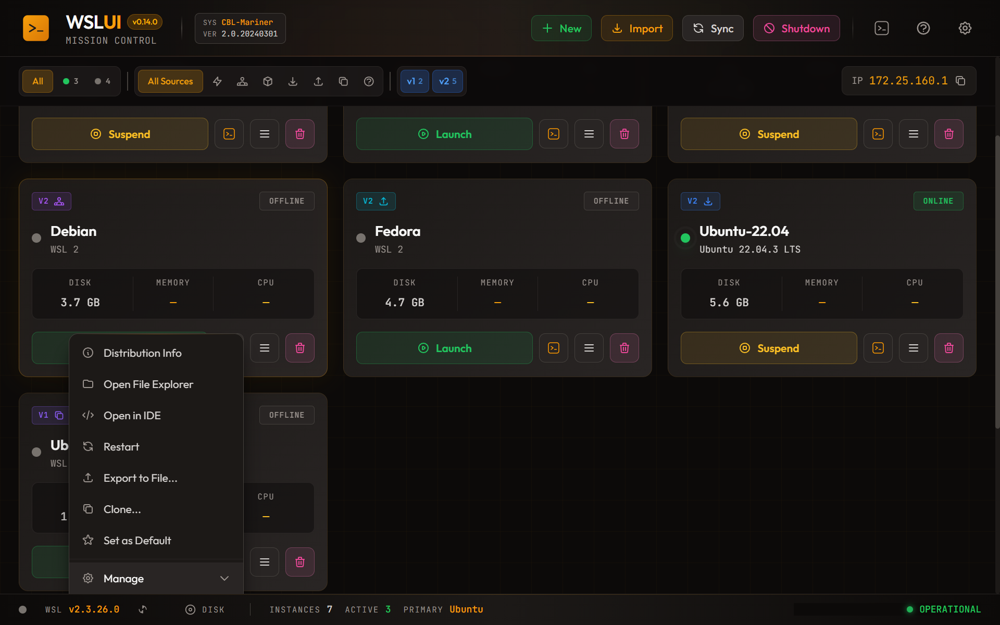

- **Move** - Relocate to a different drive
- **Resize Disk** - Expand the virtual disk
- **Compact Disk** - Reclaim unused space from the virtual disk
- **Set Default User** - Change the login user
- **Rename** - Change the distribution name
- **Sparse Mode** - Enable automatic disk reclamation
- **Set WSL Version** - Convert between WSL 1 and 2

### Compact Disk

Reclaim unused disk space from a distribution's virtual disk (VHDX):

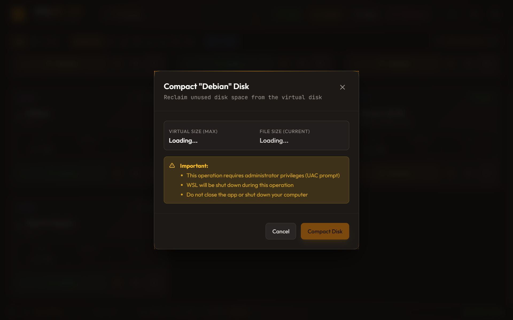

This operation performs three steps automatically:
1. **fstrim** - Zeros unused blocks inside the Linux filesystem
2. **WSL Shutdown** - Fully shuts down WSL to release file locks
3. **VHDX Compact** - Shrinks the virtual disk file on Windows

**Important notes:**
- Requires administrator privileges (UAC prompt will appear)
- WSL will be completely shut down during this operation
- Do not close the app or shut down your computer while compacting
- The operation typically takes 1-2 minutes depending on disk size

After completion, a notification shows how much space was reclaimed.

### Distribution Info

View detailed information about any distribution:

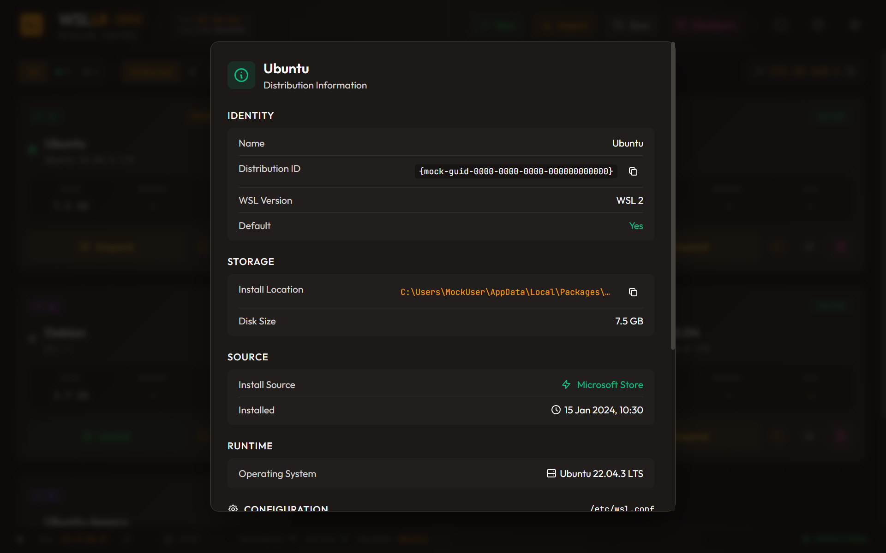

Shows installation location, creation date, disk size, and more.

---

## Remote Desktop (xrdp)

If a distribution is running `xrdp`, WSL UI exposes a **Remote Desktop** button on the distro card (next to **Open Terminal**) that launches a Windows RDP session straight into the distro's desktop.

### How it works

- The app reads `/etc/xrdp/xrdp.ini` inside each distribution to discover the listening port (defaults to 3390 in the bundled setup scripts).
- The Remote Desktop button is only enabled when xrdp is detected — distros without xrdp don't show the button.
- Clicking it launches Windows' `mstsc.exe` against `localhost:<port>`.
- If WSL idle timeouts are not configured in `.wslconfig`, the app also opens a small keep-alive terminal in the distro so the RDP session does not disconnect after WSL's default 15s idle shutdown. You can close that terminal once you're done with RDP.

### No xrdp detected

If you click Remote Desktop on a distro where xrdp can't be found, you'll see a dialog pointing to the [WSL2 Linux Desktop blog series](https://wsl-ui.octasoft.co.uk/blog/series/wsl2-linux-desktop) and a reminder to use the bundled setup scripts (see [Linux Desktop Setup Scripts](#linux-desktop-setup-scripts)).

### Multi-distro port conflicts

All WSL2 distributions share localhost, so each distro that runs xrdp needs its own port. The bundled setup scripts auto-shift to the next free port (3391, 3392, …) when 3390 is already in use. See [Issue #10](TROUBLESHOOTING.md) in the troubleshooting guide for how to assign per-distro ports manually.

---

## GPU Status & NVIDIA Containers

WSL UI surfaces GPU support for each distribution under **Settings → Per-Distribution → GPU Status**.

### Status rows

| Row | What it checks |
|---|---|
| **DirectX GPU (DXCore)** | The primary WSL2 GPU path used by CUDA, OpenCL, DirectML, and other compute APIs |
| **NVIDIA CUDA (WSL2)** | `/usr/lib/wsl/lib/libcuda.so.1` — injected by the Windows NVIDIA driver |
| **NVIDIA Container Toolkit** | Whether `nvidia-ctk` is installed in the distro |
| **CDI Specs** | Whether `/etc/cdi/nvidia.yaml` exists for container GPU passthrough |

Each row shows **Available** (green) or **Not Available**. Use **Check GPU** / **Check again** to refresh — the distribution must be running.

### When the toolkit shows "Not Available"

The panel includes a **GPU container setup guide** link that jumps to the [GPU Containers section](TROUBLESHOOTING.md#gpu-containers) of the troubleshooting guide. That guide covers:

- Installing `nvidia-container-toolkit` on Ubuntu/Debian and Fedora/RHEL
- Generating the CDI spec with `nvidia-ctk cdi generate`
- The `--network=host` workaround for the nftables error on rootful Podman in WSL2
- What to do when a Windows NVIDIA driver update breaks an existing CDI spec
- Special handling when containers run inside `podman-machine-default` rather than the selected distro

---

## Installing New Distributions

Click **New Distribution** in the header to install from multiple sources.

### Microsoft Store

One-click installation of official distributions like Ubuntu, Debian, and Kali Linux.

### Container Images

Create distributions from Docker or Podman images. WSL UI includes a built-in OCI implementation - no Docker installation required.

### Community Catalog (LXC)

Browse hundreds of distributions from the Linux Containers image server.

### Custom Sources

Add your own rootfs download URLs with optional checksum verification.

---

## Linux Desktop Setup Scripts

If you start from a vanilla distro install and want a full Linux desktop over RDP, use the distro-specific scripts in `scripts/`.

| Distro | Script | Matching Blog Guide |
|---|---|---|
| Ubuntu | `scripts/wsl2-ubuntu-desktop-xrdp.sh` | [wsl2-ubuntu-desktop-xrdp](https://wsl-ui.octasoft.co.uk/blog/wsl2-ubuntu-desktop-xrdp) |
| Fedora | `scripts/wsl2-fedora-desktop-xrdp.sh` | [wsl2-fedora-desktop-xrdp](https://wsl-ui.octasoft.co.uk/blog/wsl2-fedora-desktop-xrdp) |
| Kali | `scripts/wsl2-kali-desktop-winkex.sh` | [wsl2-kali-desktop-winkex](https://wsl-ui.octasoft.co.uk/blog/wsl2-kali-desktop-winkex) |
| Arch | `scripts/wsl2-arch-desktop-xrdp.sh` | [wsl2-arch-desktop-xrdp](https://wsl-ui.octasoft.co.uk/blog/wsl2-arch-desktop-xrdp) |
| openSUSE | `scripts/wsl2-opensuse-desktop-xrdp.sh` | [wsl2-opensuse-desktop-xrdp](https://wsl-ui.octasoft.co.uk/blog/wsl2-opensuse-desktop-xrdp) |

Run the script inside the target distro shell as your normal Linux user:

```bash
bash /path/to/wsl2-ui/scripts/wsl2-ubuntu-desktop-xrdp.sh
```

Each script includes:
- End-to-end desktop + XRDP/Win-KeX install flow for that distro
- Automatic `/tmp/.X11-unix` repair for the common WSLg/XRDP socket conflict
- XRDP port conflict handling (defaults to 3390, auto-shifts if already used)
- Service startup validation and troubleshooting hints
- Reminder for `.wslconfig` idle-timeout settings needed for stable RDP sessions

For common fixes after setup (black screen, auth failures, port conflicts), see:
- [WSL2 Desktop Troubleshooting](https://wsl-ui.octasoft.co.uk/blog/wsl2-gui-troubleshooting)

---
## Backup and Restore

### Export

Export any distribution to a `.tar` archive for backup or sharing:

1. Open the Quick Actions menu
2. Select **Export to File**
3. Choose a save location

### Import

Restore a distribution from a backup:

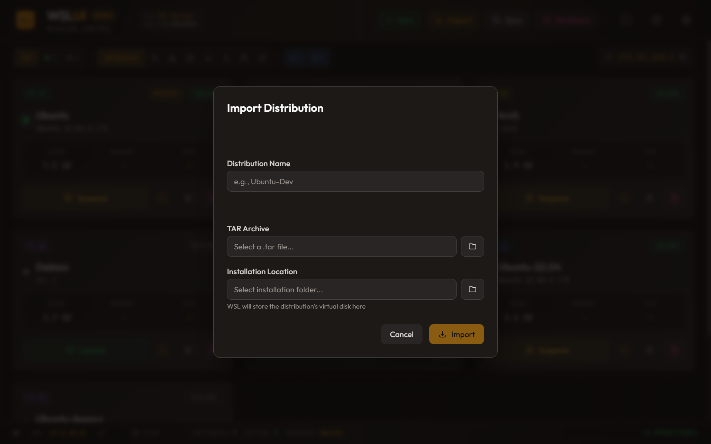

1. Click **Import** in the header
2. Select your `.tar` file
3. Choose a name and installation location

### Clone

Duplicate an existing distribution:

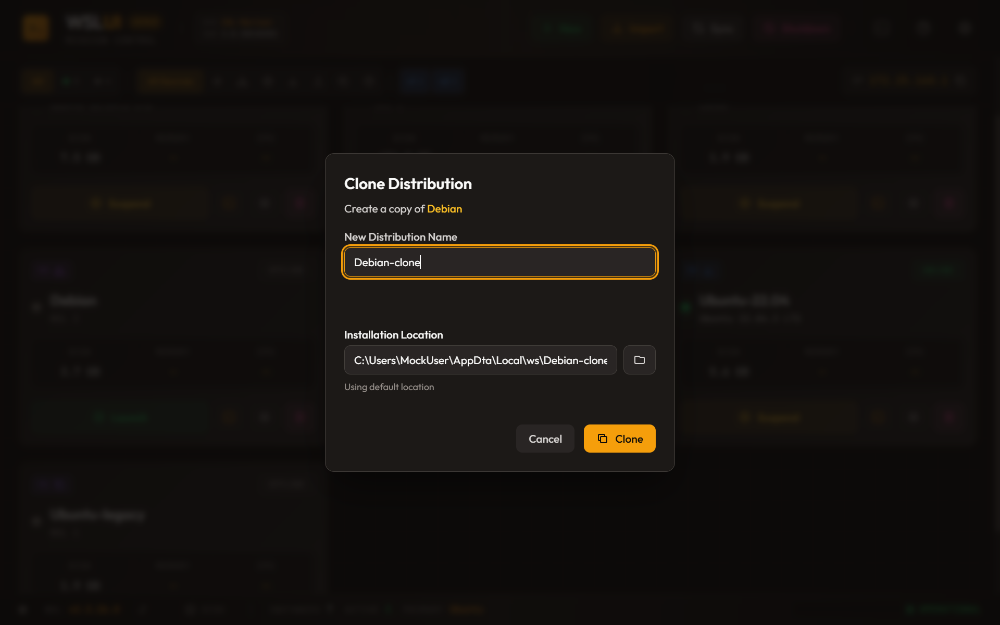

---

## Custom Actions

Create reusable commands that run inside your distributions.

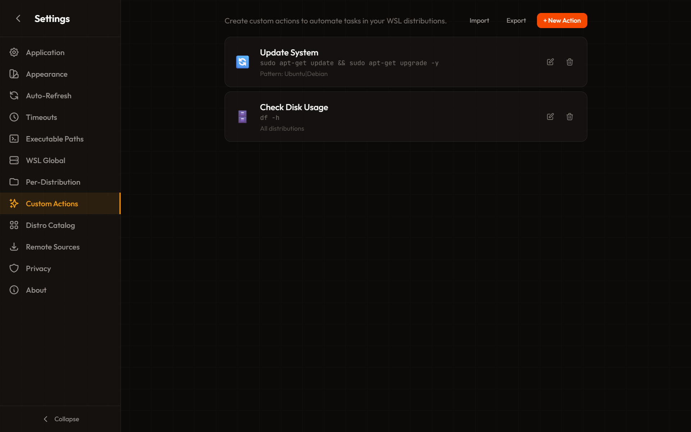

### Creating Actions

Each action has:
- **Name** and **Icon** for display
- **Command** with variable substitution
- **Target** - All distributions, specific names, or regex patterns
- **Options** - Run in terminal, require sudo, show output

### Variables

Use these variables in your commands:
- `${DISTRO_NAME}` - Distribution name
- `${HOME}` - Linux home directory
- `${USER}` - Default user
- `${WINDOWS_HOME}` - Windows home in WSL path format

---

## Language

WSL UI ships with translations for a range of languages and automatically detects your system language on first launch.

### Supported languages

English, Simplified Chinese (简体中文), Traditional Chinese (繁體中文), Japanese (日本語), Korean (한국어), Spanish (Español), Hindi (हिन्दी), French (Français), German (Deutsch), Portuguese — Brazil (Português), Arabic (العربية, RTL), Russian (Русский), Polish (Polski), Turkish (Türkçe), Italian (Italiano).

### Changing Language

1. Open **Settings** from the gear icon in the header
2. Select the **Language** section under **Application**
3. Choose your preferred language from the list

The change takes effect immediately - no restart required.

### Auto-Detection

On first launch, WSL UI matches your Windows display language to the closest supported language. For example, `fr-CA` (French Canadian) will resolve to French, and `zh-TW` will resolve to Traditional Chinese.

If your language isn't detected correctly, you can always switch manually in settings.

### CJK input (IME)

Composing CJK input with an IME no longer triggers default-button actions when you press Enter to confirm composition — the Enter key only fires the underlying action once composition is complete. CJK glyphs also prefer Windows-native fonts before any non-bundled fallback for clean rendering.

### Requesting a New Language

Don't see your language? Click **Request it on GitHub** under the language picker, or [open an issue](https://github.com/octasoft-ltd/wsl-ui/issues) directly. Community-contributed translations are welcome — see the [contribution workflow](https://github.com/octasoft-ltd/wsl-ui) in the repository.

### Garbled text after reinstall?

If text appears garbled or in the wrong language after reinstalling (or switching between Store and EXE installs), see [Issue #13](TROUBLESHOOTING.md) — typically resolved by clearing `%LOCALAPPDATA%\wsl-ui` before reinstalling.

---

## Settings

Access settings from the gear icon in the header.

### Application Settings

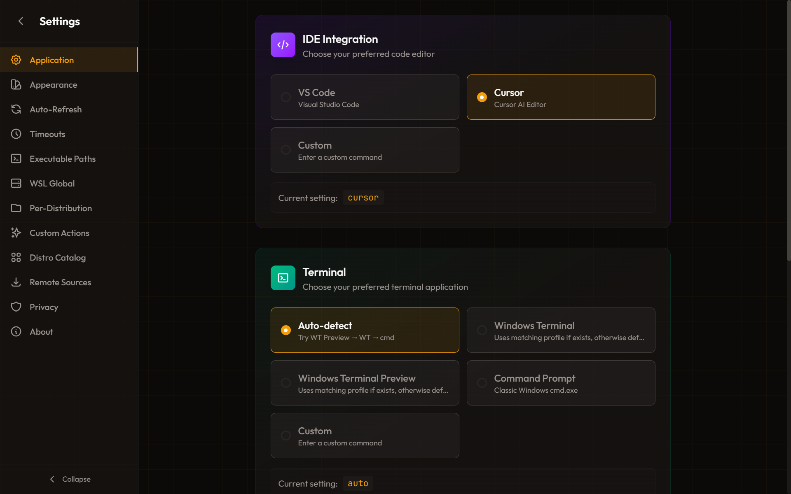

Configure your preferred terminal and IDE, startup behavior, and system tray options.

### WSL Global Settings

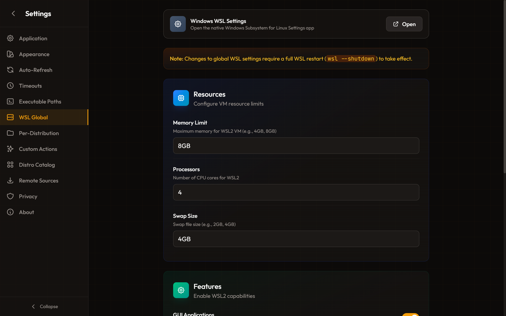

Edit `.wslconfig` settings that apply to all distributions:
- Memory and CPU limits
- Swap size and location
- GUI applications (WSLg)
- Networking mode and DNS/firewall options (see below)

#### Networking modes

The **Networking Mode** dropdown exposes every mode WSL supports:

| Mode | When to use |
|---|---|
| **NAT (default)** | Standard WSL2 networking — distros share an internal NAT, with port-forwarding for localhost |
| **Mirrored** | WSL adopts the Windows host network interfaces — best for VPNs and host-discovery scenarios |
| **virtioproxy** | High-performance virtio-based proxy networking (WSL 2.x) |
| **None** | Disables WSL networking entirely |
| **Bridged (deprecated)** | Microsoft has deprecated bridged mode — use virtioproxy or mirrored instead. Selecting it shows a warning. |

#### DNS Tunneling and Windows Firewall

Two toggles below the networking mode (require **Windows 11 22H2 or later**):

- **DNS Tunneling** — Proxies DNS requests from WSL to Windows through a virtual device instead of TCP/UDP. Improves reliability on networks where DNS-over-UDP is blocked or where VPNs intercept queries.
- **Windows Firewall** — Lets Windows Firewall rules filter WSL network traffic. Useful for environments that require firewall enforcement.

> Changes to networking settings only take effect after `wsl --shutdown`. See [Pending Configuration Changes](#pending-configuration-changes).

### Per-Distribution Settings

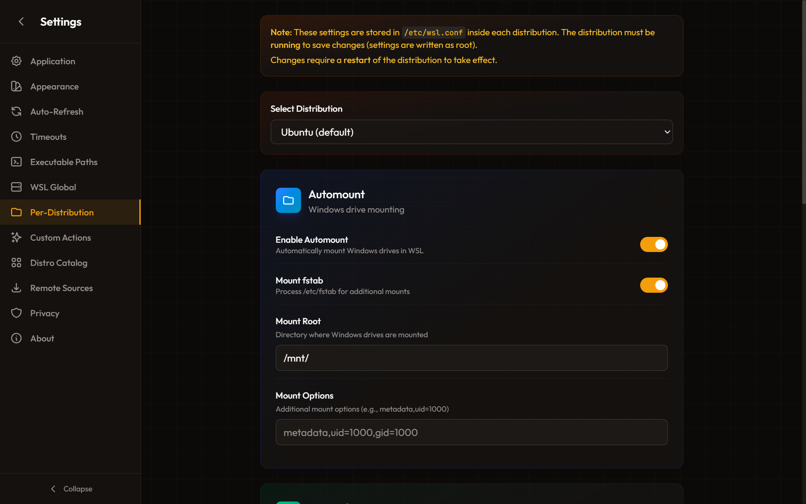

Edit `wsl.conf` settings for individual distributions:
- Automount options
- Network configuration
- Systemd and boot commands
- Windows interoperability

### Remote Sources

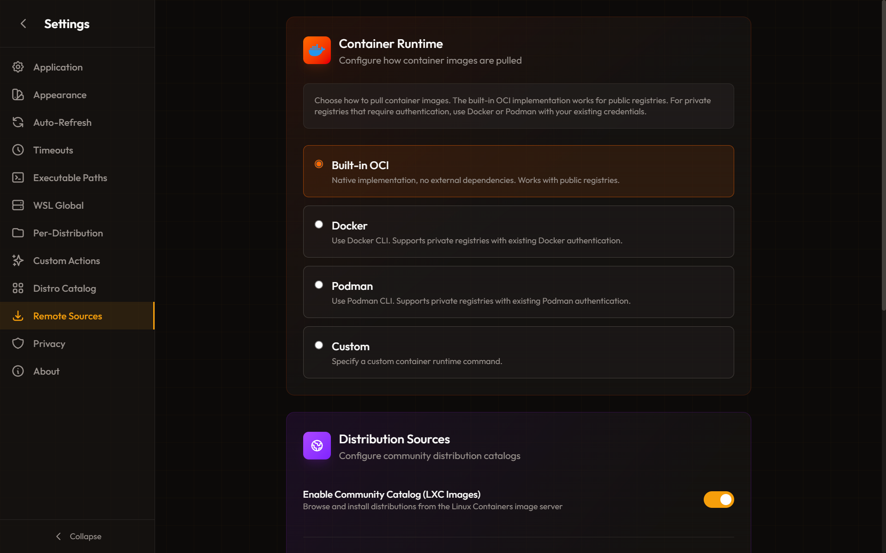

Manage distribution catalogs:
- Microsoft Store entries
- Custom download URLs
- Container image references
- LXC catalog settings

### WSL Distribution Sources (custom `wsl --install` manifests)

A separate panel — **WSL Distribution Sources** — lets you point WSL's native `wsl --list --online` and `wsl --install <name>` commands at a third-party manifest URL by writing the `HKLM\…\Lxss\DistributionListUrl` (or `DistributionListUrlAppend`) registry value.

This is different from the LXC/download/container catalogs above, which only affect WSL UI's own install dialog. Custom distribution sources apply **machine-wide** to every WSL CLI command.

**How to use it:**

1. Open **Settings → WSL Distribution Sources**.
2. Choose a **Mode**:
   - **Append to default list** *(recommended)* — adds the manifest's distros alongside Microsoft's defaults.
   - **Replace default list** — hides Microsoft's defaults from `wsl --list --online`.
3. Enter the **Manifest URL** (`http://`, `https://`, or `file://`; `file://` requires WSL 2.4.4 or later).
4. Click **Preview** to see which distributions the manifest exposes before committing.
5. Click **Apply** — Windows will prompt for administrator approval (UAC) because the change is written to `HKLM`.

The panel also offers one-click **Suggested sources** for common community manifests, and a **Reset to defaults** button to remove any custom registration.

> Only add manifests you trust — `wsl --install` will download and execute distro images from whatever URL you register.

### Disk Mounting

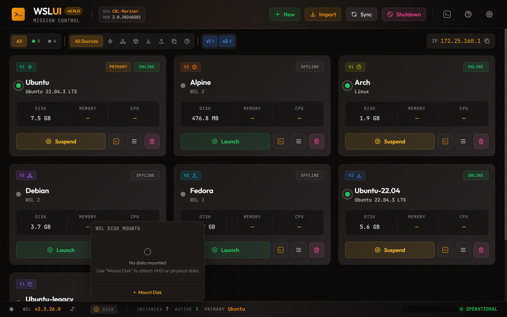

Mount VHD files or physical disks into WSL.

---

## Pending Configuration Changes

Some `.wslconfig` changes (memory, processors, networking mode, GUI applications, etc.) only take effect after a full WSL restart (`wsl --shutdown`). WSL UI polls the running WSL state against your saved config every 60 seconds and surfaces a **warning notification** when they don't match:

> **WSL Config Pending Restart** — Your .wslconfig has changes that require WSL restart to take effect. Run `wsl --shutdown` to apply.

The notification stays visible until the changes are applied. You can:

- Run `wsl --shutdown` from PowerShell or Command Prompt, or
- Use **Force Shutdown WSL** from the status bar's WSL menu

Once the running state matches the saved config, the notification clears automatically. If you dismiss it manually, it will reappear on the next poll if changes are still pending.

---

## Themes

WSL UI includes 17 built-in themes with full customization support.

### Built-in Themes

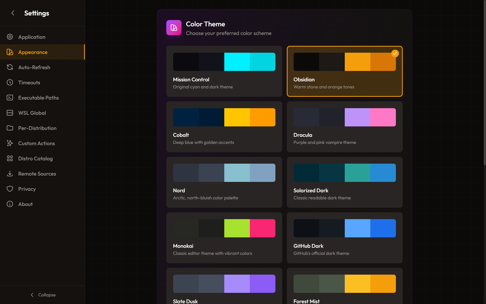

**Dark Themes:** Mission Control, Obsidian, Cobalt, Dracula, Nord, Solarized Dark, Monokai, GitHub Dark

**Light Themes:** Daylight, Mission Control Light, Obsidian Light

**Middle-Ground:** Slate Dusk, Forest Mist, Rose Quartz, Ocean Fog

**Accessibility:** High Contrast (dark), High Contrast Light - Maximum contrast themes for low vision users

### Theme Example

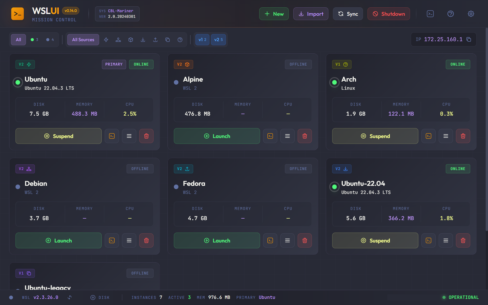
*Dracula - Purple/pink vampire theme*

### Custom Theme Editor

Create your own theme with the custom editor. Adjust 29 color variables across backgrounds, text, borders, accents, and buttons with live preview.

---

## Keyboard Shortcuts & Accessibility

WSL UI is designed to be fully accessible with keyboard navigation and screen readers.

### Navigation

| Key | Action |
|-----|--------|
| **Tab** | Move to next interactive element |
| **Shift+Tab** | Move to previous interactive element |
| **Enter** | Activate buttons, submit forms |
| **Space** | Toggle checkboxes, activate buttons |
| **Arrow Keys** | Navigate within menus and lists |

### Dialogs & Menus

| Key | Action |
|-----|--------|
| **Escape** | Close any open dialog or menu |
| **Enter** | Submit dialog form (when valid) |
| **Tab** | Navigate between dialog fields |

### Quick Actions Menu

| Key | Action |
|-----|--------|
| **Enter** or **Space** | Open menu from trigger button |
| **Escape** | Close menu |
| **Arrow Down/Up** | Navigate menu items |

### Accessibility Features

- **Screen Reader Support** - All dialogs announce their title, status changes are announced via ARIA live regions
- **Focus Management** - Focus is trapped within dialogs and returns to the trigger element when closed
- **High Contrast Themes** - Two high contrast themes available (dark and light) for low vision users
- **Reduced Motion** - Animations are disabled when system prefers reduced motion
- **Keyboard Navigation** - All features accessible without a mouse

---

## Troubleshooting

See [TROUBLESHOOTING.md](TROUBLESHOOTING.md) for solutions to common issues.

---

## More Information

- [Privacy Policy](PRIVACY.md)
- [GitHub Repository](https://github.com/octasoft-ltd/wsl-ui)
- [Report Issues](https://github.com/octasoft-ltd/wsl-ui/issues)

